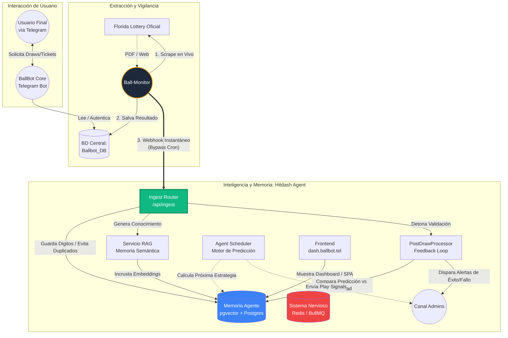

# 🧠 HITDASH + BALLBOT: ARQUITECTURA APEX (v4)

**DIAGNÓSTICO TÉCNICO:** El ecosistema de *Ballbot Systems* ha evolucionado de un modelo basado en encuestas periódicas (Polling/Crons) a una **Arquitectura Manejada por Eventos (Event-Driven) en Tiempo Real**.

> [!IMPORTANT]
> El descubrimiento más crítico de esta autopsia es la inyección del `IngestRouter`. Ya no dependemos de un cron de 15 minutos para que el agente reaccione a la lotería. Ahora operamos en nanosegundos tras la publicación de Florida Lottery.

---

## 1. MAPA MENTAL DEL FLUJO (MERMAID)

## 2. ANÁLISIS FORENSE DEL FLUJO VITAL (CÓMO APRENDE)

El ecosistema entero converge en un ciclo cerrado donde convergen la recolección, predicción y castigo/recompensa algorítmica:

### Fase 1: El Despertar del Monitor (Acquisition)
El `ball-monitor` (corriendo en PM2) intercepta que el estado de Florida ha soltado un nuevo sorteo (Ej: Pick 3 Midday). Lo procesa y salva inmediatamente en la base de datos pública del Bot de Telegram para que los apostadores lo vean. 
Inmediatamente, dispara un Webhook privado a `localhost:3005/api/ingest` alertando al servidor Hitdash. Pasa la llave secreta y los dígitos ganadores exactos.

### Fase 2: Ingesta Semántica y RAG
El **Hitdash Server** recibe el Webhook. 
1. Revisa que no exista ese sorteo en la base de datos (Idempotencia).
2. Llama al `RAGService`. Convierte los simples números (ej. `[3, 8, 1]`) en texto de conocimiento: `"PICK3 MIDDAY 2026-04-12: P1=3 P2=8 P3=1"`. Lo vectoriza usando el motor de IA embebido y lo almacena en `pgvector`. El agente ahora lo *"recuerda"*.

### Fase 3: Auto-Corrección Cognitiva (El Factor APEX)
El Webhook encola un trabajo en Redis para el **PostDrawProcessor**.
Aquí se ejecuta la magia real:
El sistema voltea a ver qué **Predicciones Teóricas** había sugerido Hitdash horas ANTES de que ocurriera este sorteo. 
Cruza la Predicción contra los Números Reales (Recibidos del monitor). 
¿Acertó Hitdash? El bot envía una notificación masiva de Telegram celebrando la victoria, y ajusta las "Pesas Adaptativas" (Adaptive Weights) de esa estrategia matemática en la base de datos para darle MÁS confianza en el futuro. 
¿Falló? Disminuye sus métricas de *Hit Rate* y el Agente se adapta matemáticamente buscando un nuevo modelo (Machine Learning clásico vía pesos relacionales).

### Fase 4: Operación de Usuario Paralela
Mientras todo este ciclo de altísima ingeniería cognitiva ocurre de fondo:
- Los usuarios mortales chatean vía Telegram con `ballbot-bot` para revisar sus cartones o comprar, los cuales son respondidos velozmente desde la BD principal.
- Tú, como administrador Apex, abres `https://dash.ballbot.tel`. El bypass estático de Nginx carga Vue.js casi a la velocidad de la luz, interconectándose al servidor de Express para mostrarte gráficos del `AgentScheduler` y el `Hit Rate` resultante del ciclo descrito arriba.
